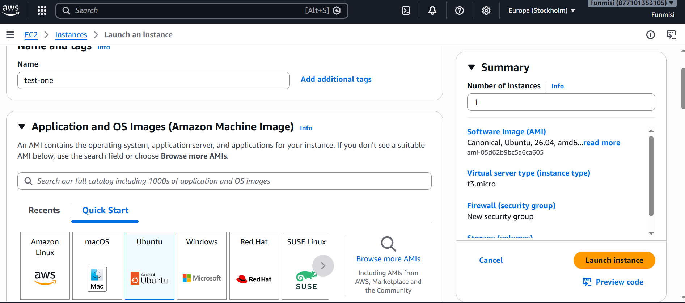
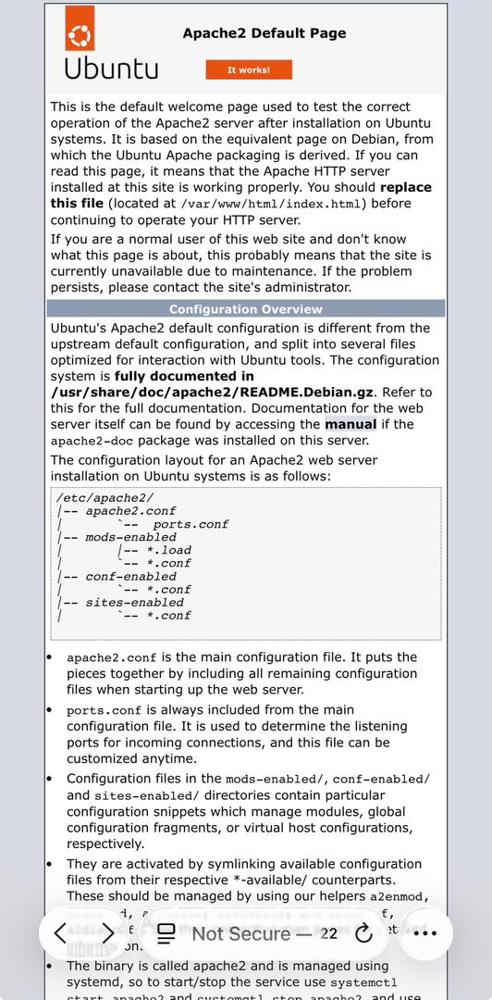

## WEB STACK IMPLEMENTATION (LAMP STACK) IN AWS

### Introduction:
__A LAMP stack is a bundle of four different software technologies that developers use to build websites and web applications. LAMP is an acronym for the operating system, Linux; the web server, Apache; the database server, MySQL; and the programming language, PHP__

## Step 0: Prerequisites
__1.__ EC2 Instance of t3.micro type and Ubuntu 26.04 LTS (HVM) was lunched in the eu-north-1 region using the AWS console.
__2.__ Created SSH key pair named test to access the instance on port 22

   

__3.__ The security group was configured with the following inbound rules:

Allow traffic on port 80 (HTTP) with source from anywhere on the internet.
Allow traffic on port 443 (HTTPS) with source from anywhere on the internet.
Allow traffic on port 22 (SSH) with source from any IP address. This is opened by default.

 

__4.__ The default VPC and Subnet was used for the networking configuration.


__5.__ The private ssh key that got downloaded was located and then used to connect to the instance by running

Using windows powershell
```
CD downloads
```
```
ssh -i test.pem ubuntu@56.228.34.90
```
__Where username=ubuntu and public ip address=56.228.34.90__


## Step 1 - Install Apache and Update the Firewall
__1.__ __Update and upgrade list of packages in package manager__
```
sudo apt update
```
__2.__ __Install apache__
```
sudo apt install apache2
```
__3.__ __Verify that apache is running on as a service on the OS.__
```
sudo systemctl enable apache2
```
```
sudo systemctl status apache2
```
If it green and running, then apache2 is correctly installed


__4.__ __The server is running and can be accessed locally in the ubuntu shell by running the command below:__
```
curl http://localhost:80
```
## OR
```
curl http://127.0.0.1:80
```
__5.__ __Test with the public IP address if the Apache HTTP server can respond to request from the internet using the url on a browser.__
```
http://56.228.34.90
```


This shows that the web server is correctly installed and it is accessible through the firewall.

## Step 2 - Install MySQL
__1.__ __Installing a DBMS to store and manage data for the website__
```
sudo apt install mysql-server
```
__2.__ __Log in to mysql console__
```
sudo mysql
```
__3.__ __Set a password for root user using caching_sha2_password as default authentication method.__

__Here, the user's password was defined as "PassWord.1"__
```
ALTER USER root@'localhost' IDENTIFIED WITH caching_sha2_password BY 'PassWord.1';
```

__4.__ __Trying sudo mysql again prompted ERROR 1045 (28000): Access denied for user 'root'@'localhost' (using password: NO) so I used ```mysql -u root -p``` to force sql to prompt password__


__5.__ __Exit the MySQL shell__
```
exit
```
## Step 3 - Install PHP
__1.__ __Install php, PHP is the component of the set up that processes code to display dynamic content to the end user.__

The following would be installed:
-php package
-php-mysql, a PHP module that allows PHP to communicate with MySQL-based databases.
-libapache2-mod-php, to enable Apache to handle PHP files.

```
sudo apt install php libapache2-mod-php php-mysql
```

__2.__  __Confirm PHP version__
```
php -v
```


At this point, your LAMP stack is completely installed and fully functional.

[x] Linux (Ubuntu)
[x] Apache HTTP Server
[x] MySQL
[x] PHP

To test your setup with a PHP script, it’s best to set up a proper Apache Virtual Host to hold your website’s files and folders. Virtual host allows you to have multiple websites located on a single machine and users of the websites will not even notice it.

## Step 4 - Create a virtual host for the website using Apache
__1.__  __The default directory serving the apache default page is /var/www/html. Create your document directory next to the default one.__

Created the directory for projectlamp using "mkdir" command
```
sudo mkdir /var/www/projectlamp
```
__Assign the directory ownership with $USER environment variable which references the current system user.__
```
sudo chown -R $USER:$USER /var/www/projectlamp
```
__2.__  __Create and open a new configuration file in apache’s “sites-available” directory using vim.__
```
sudo nano /etc/apache2/sites-available/projectlamp.conf
```
__3.__  __Show the new file in sites-available__
```
sudo ls /etc/apache2/sites-available
```
Output:
000-default.conf default-ssl.conf projectlamp.conf


With the VirtualHost configuration, Apache will serve projectlamp using /var/www/projectlamp as its web root directory.

__4.__  __Enable the new virtual host__
```
sudo a2ensite projectlamp
```

__5.__  __Disable apache’s default website.__


This is because Apache’s default configuration will overwrite the virtual host if not disabled. This is required if a custom domain is not being used.
```
sudo
a2dissite 000-default
```
__6.__  __Reload apache for changes to take effect.__
```
sudo systemctl reload apache2
```


__7.__ __ The new website is now active but the web root /var/www/projectlamp is still empty. Create an index.html file in this location so to test the virtual host work as expected.__
```
nano /var/www/projectlamp/info.php
```
paste inside
```
<html><head>
		      <title>Project Lamp website</title>
		        </head>
			  <body>
				      <h1>Hello World!</h1>

				          <p>This is the landing page of <strong>Project Lamp</strong>.</p>
					    

</body></html>
```


__Open the website on a browser using the public IP address.__
```
http://56.228.34.90/
```
## Step 5 - Enable PHP on the website

With the default DirectoryIndex setting on Apache, index.html file will always take precedence over index.php file. This is useful for setting up maintenance page in PHP applications, by creating a temporary index.html file containing an informative message for visitors. The index.html then becomes the landing page for the application. Once maintenance is over, the index.html is renamed or removed from the document root bringing back the regular application page. If the behaviour needs to be changed, /etc/apache2/mods-enabled/dir.conf file should be edited and the order in which the index.php file is listed within the DirectoryIndex directive should be changed.

__1.__  __Open the dir.conf file with vim to change the behaviour__
```
sudo vim /etc/apache2/mods-enabled/dir.conf
```
```
<IfModule mod_dir.c>
  # Change this:
  # DirectoryIndex index.html index.cgi index.pl index.php index.xhtml index.htm
  # To this:
  DirectoryIndex index.php index.html index.cgi index.pl index.xhtml index.htm
</IfModule>
```
__2.__  __Reload Apache__

Apache is reloaded so the changes takes effect.

```
sudo systemctl reload apache2
```
__3.__  __Create a php test script to confirm that Apache is able to handle and process requests for PHP files.__

A new index.php file was created inside the custom web root folder.
```
vim /var/www/projectlamp/index.php
```
Add the text below in the index.php file
```
<?php
phpinfo();
```


This page provides information about the server from the perspective of PHP. It is useful for debugging and to ensure the settings are being applied correctly.

After checking the relevant information about the server through this page, It’s best to remove the file created as it contains sensitive information about the PHP environment and the ubuntu server. It can always be recreated if the information is needed later.
```
sudo rm /var/www/projectlamp/index.php
```


__Conclusion:__

The LAMP stack provides a robust and flexible platform for developing and deploying web applications. By following the guidelines outlined in this documentation, It was possible to set up, configure, and maintain a LAMP environment effectively, enabling the creation of powerful and scalable web solutions.


