## WEB STACK IMPLEMENTATION (LEMP STACK)

### Introduction

__LEMP is an open-source web application stack used to develop web applications. The term LEMP is an acronym that represents L for the Linux Operating system, Nginx (pronounced as engine-x, hence the E in the acronym) web server, M for MySQL database, and P for PHP scripting language.__


## Step 0: Prerequisites

__1.__ EC2 Instance of t3.micro type and Ubuntu 26.04 LTS (HVM) was lunched in the eu-north-1 region using the AWS console.

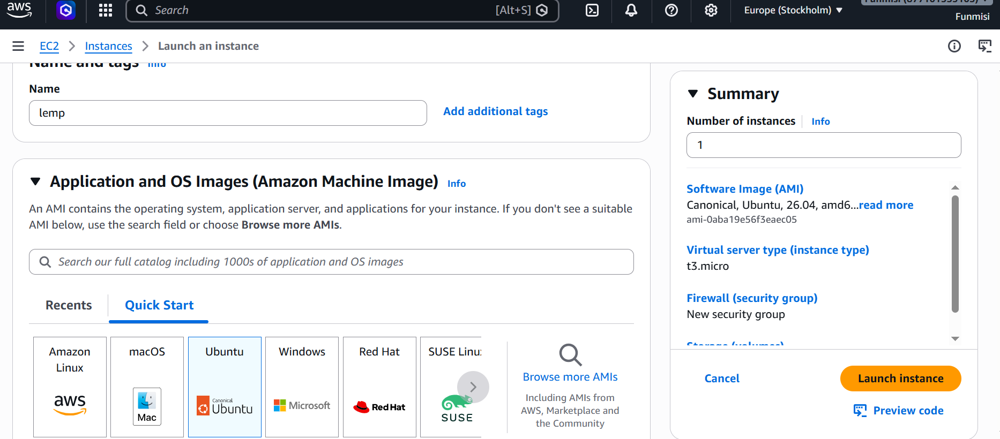
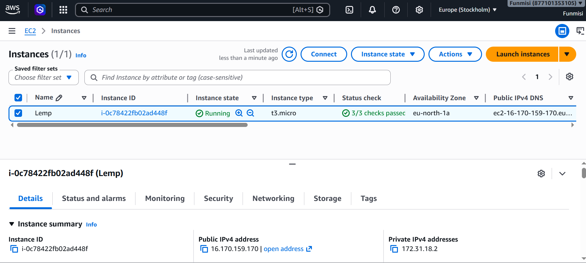

__2.__ Created SSH key pair named test to access the instance on port 22

__3.__ The security group was configured with the following inbound rules:

- Allow traffic on port 80 (HTTP) with source from anywhere on the internet.
- Allow traffic on port 443 (HTTPS) with source from anywhere on the internet.
- Allow traffic on port 22 (SSH) with source from any IP address. This is opened by default.

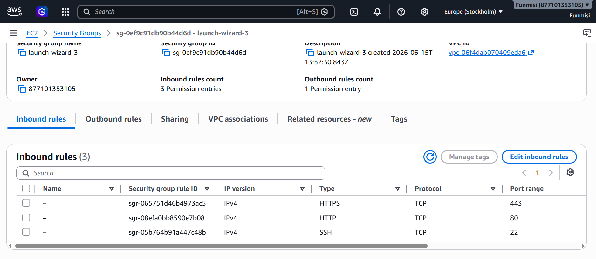

__4.__ The default VPC and Subnet was used for the networking configuration.

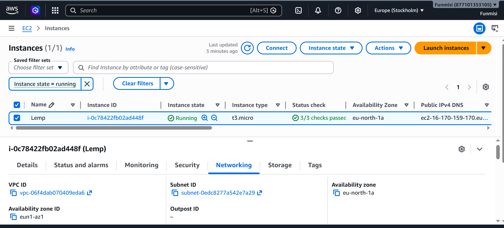

__5.__ The private ssh key that got downloaded was located, then used to connect to the instance by running
```
ssh -i test.pem ubuntu@16.170.159.170

```
Where __username=ubuntu__ and __public ip address=16.170.159.170__

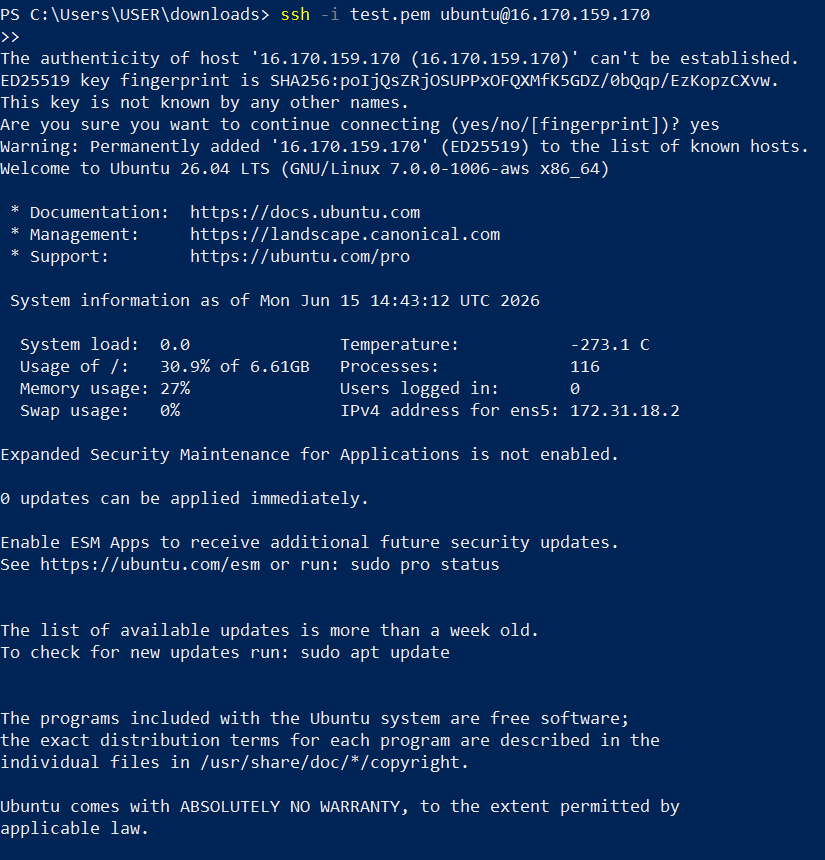

## Step 1 - Installing the nginx web server

__1.__ __Update and upgrade the server’s package index__

```
sudo apt update
```
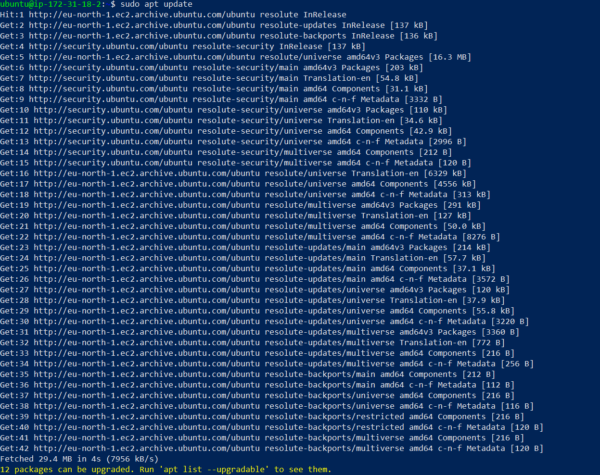

__2.__ __Install nginx__

```
sudo apt install nginx
```
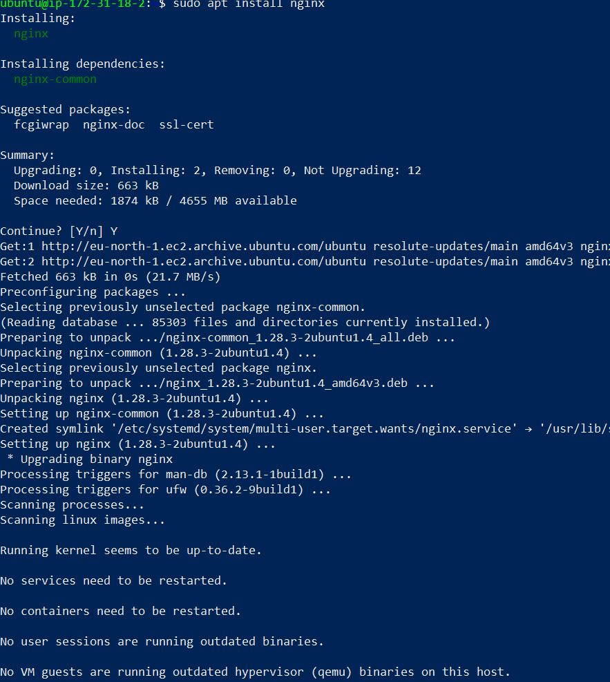

__3.__ __Verify that nginx is properly installed__

```
sudo systemctl status nginx
```
If it's green then nginx is correctly installed

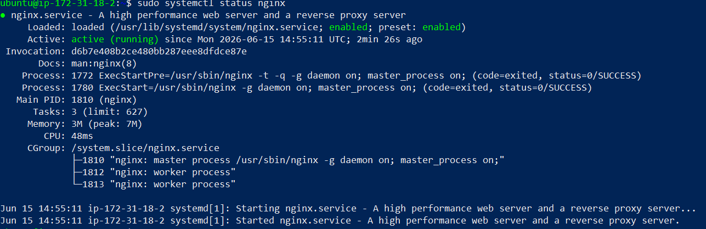

__4.__ __Access nginx on Ubuntu shell__

```
curl http://127.0.0.1:80
```
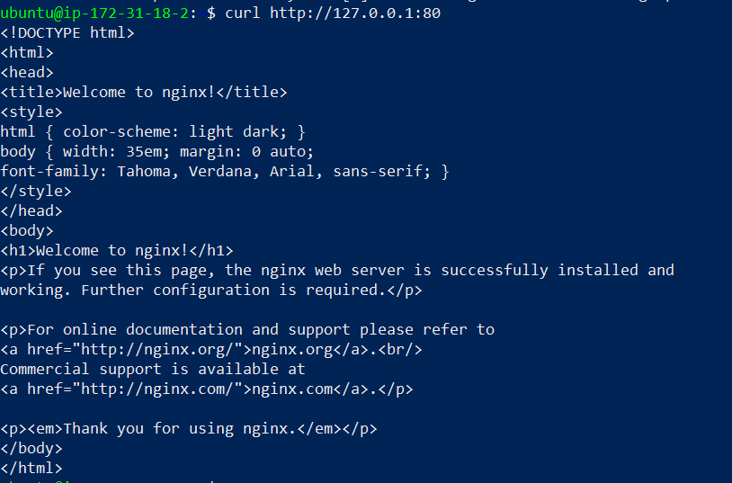

__5.__ __Test with the public IP address if the Nginx server can respond to request from the internet using the url on a browser.__

```
http://16.170.159.170
```
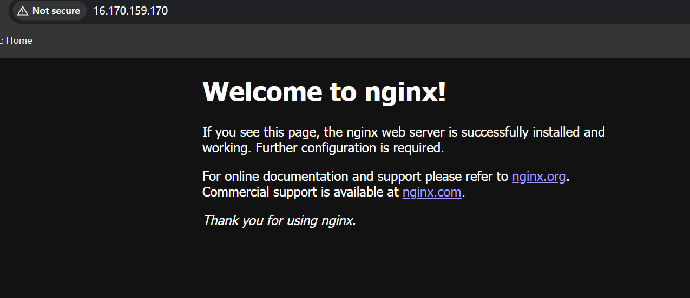

## Step 2 - Installing MySQL

__1.__ __Install a database management system (DBMS)__

MySQL was installed in this project. It is a database management system used within PHP environments.
```
sudo apt install mysql-server
```
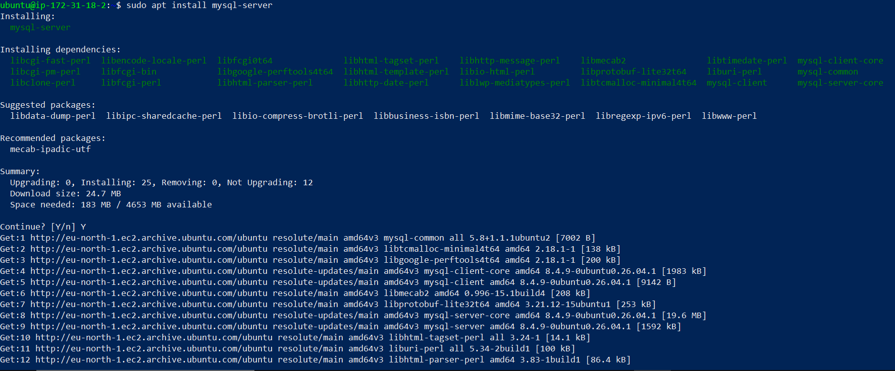

__2.__ __Log in to mysql console__
```
sudo mysql
```
This connects to the MySQL server as the administrative database user __root__ infered by the use of __sudo__ when running the command.
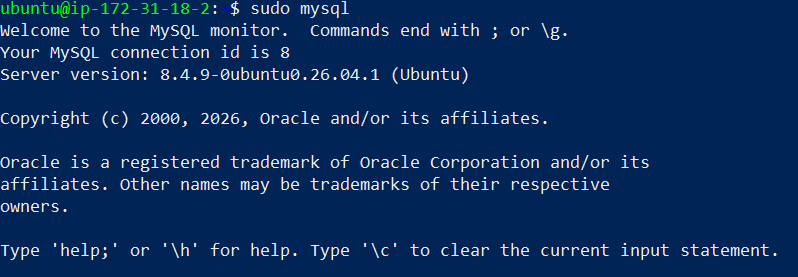

__3.__ __Set a password for root user using caching_sha2_password as default authentication method.__

Here, the user's password was defined as "PassWord.1"

```
ALTER USER root@'localhost' IDENTIFIED WITH caching_sha2_password BY 'PassWord.1';
```
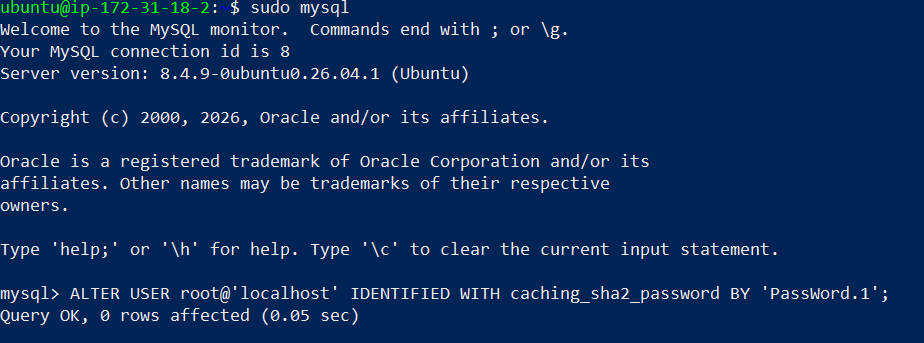

Exit the MySQL shell
```
exit
```

__4.__ ___Log into MySQL console.__

A command prompt for password was noticed after running the command below.
```
sudo mysql -p
```
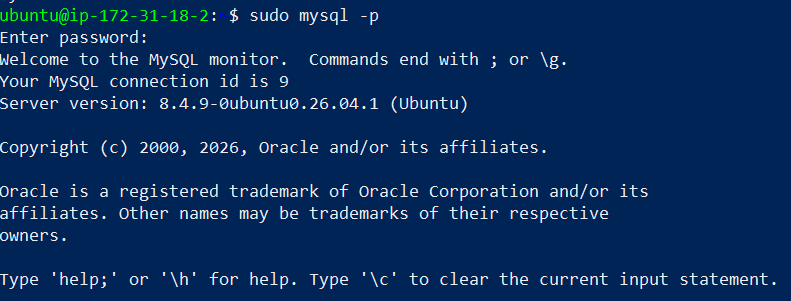

Exit MySQL shell
```
exit
```

## Step 3 - Install PHP

__1.__ __Install php__

Install php-fpm (PHP fastCGI process manager) and tell nginx to pass PHP requests to this software for processing. Also, install php-mysql, a php module that allows PHP to communicate with MySQL-based databases. Core PHP packages will automatically be installed as dependencies.

The following were installed:
- php-fpm (PHP fastCGI process manager)
- php-mysql

```
sudo apt install php-fpm php-mysql
```
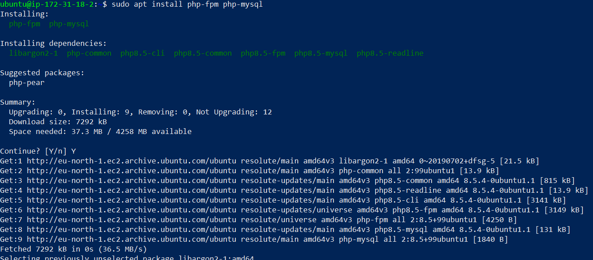

## Step 4 - Configure nginx to use PHP processor

__1.__ __Create a root web directory for your_domain__

```
sudo mkdir /var/www/projectLEMP
```

__2.__ __Assign the directory ownership with $USER which will reference the current system user__

```
sudo chown -R $USER:$USER /var/www/projectLEMP
```

__3.__ __Create a new configuration file in Nginx’s “sites-available” directory__.

```
sudo nano /etc/nginx/sites-available/projectLEMP
```
Paste in the following bare-bones configuration:

```
server {
  listen 80;
  server_name projectLEMP www.projectLEMP;
  root /var/www/projectLEMP;

  index index.html index.htm index.php;

  location / {
    try_files $uri $uri/ =404;
  }

  location ~ \.php$ {
    include snippets/fastcgi-php.conf;
    fastcgi_pass unix:/var/run/php/php8.1-fpm.sock;
  }

  location ~ /\.ht {
    deny all;
  }
}
```

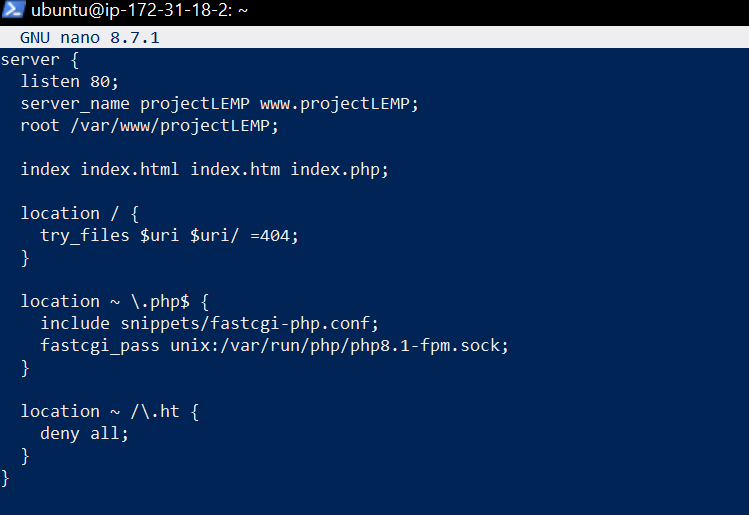

### Here’s what each directives and location blocks does:

- __listen__ - Defines what port nginx listens on. In this case it will listen on port 80, the default port for HTTP.

- __root__ - Defines the document root where the files served by this website are stored.

- __index__ - Defines in which order Nginx will prioritize the index files for this website. It is a common practice to list index.html files with a higher precedence than index.php files to allow for quickly setting up a maintenance landing page for PHP applications. You can adjust these settings to better suit your application needs.

- __server_name__ - Defines which domain name and/or IP addresses the server block should respond for. Point this directive to your domain name or public IP address.

- __location /__ - The first location block includes the try_files directive, which checks for the existence of files or directories matching a URI request. If Nginx cannot find the appropriate result, it will return a 404 error.

- __location ~ \.php$__ - This location handles the actual PHP processing by pointing Nginx to the fastcgi-php.conf configuration file and the php7.4-fpm.sock file, which declares what socket is associated with php-fpm.

- __location ~ /\.ht__ - The last location block deals with .htaccess files, which Nginx does not process. By adding the deny all directive, if any .htaccess files happen to find their way into the document root, they will not be served to visitors.

__4.__ __Activate the configuration by linking to the config file from Nginx’s sites-enabled directory__

```
sudo ln -s /etc/nginx/sites-available/projectLEMP /etc/nginx/sites-enabled/
```
This will tell Nginx to use this configuration when next it is reloaded.

__5.__ __Test the configuration for syntax error__

```
sudo nginx -t
```
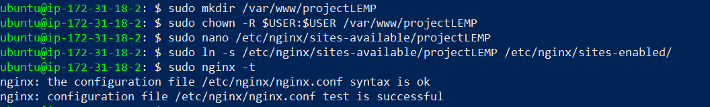

__6.__ __Disable the default Nginx host that currently configured to listen on port 80__

```
sudo unlink /etc/nginx/sites-enabled/default
```

__7.__ __Reload Nginx to apply the changes__
```
sudo systemctl reload nginx
```

__8.__ __The new website is now active but the web root /var/www/projectLEMP is still empty. Create an index.html file in this location so to test the virtual host work as expected.__

```
sudo echo 'Hello LEMP from hostname' $(TOKEN=`curl -X PUT "http://169.254.169.254/latest/api/token" -H "X-aws-ec2-metadata-token-ttl-seconds: 21600"` && curl -H "X-aws-ec2-metadata-token: $TOKEN" -s http://169.254.169.254/latest/meta-data/public-hostname) 'with public IP' $(TOKEN=`curl -X PUT "http://169.254.169.254/latest/api/token" -H "X-aws-ec2-metadata-token-ttl-seconds: 21600"` && curl -H "X-aws-ec2-metadata-token: $TOKEN" -s http://169.254.169.254/latest/meta-data/public-ipv4) > /var/www/projectLEMP/index.html
```
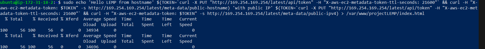

#### Open the website on a browser using IP address
```
http://16.170.159.170
```
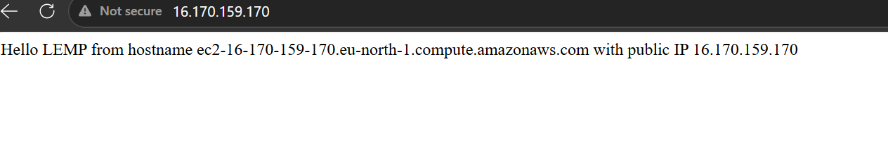
The LEMP stack is now fully configured.

## Step 5 - Testing PHP with Nginx

Test the LEMP stack to validate that Nginx can handle the .php files off to the PHP processor.

__1.__ __Create a test PHP file in the document root. Open a new file called info.php within the document root.__

```
sudo nano /var/www/projectLEMP/info.php
```
Past in:
```
<?php
phpinfo();
```
__2.__ __Access the page on the browser and attach /info.php__
```
http://16.170.159.170/info.php
```


After checking the relevant information about the server through this page, It’s best to remove the file created as it contains sensitive information about the PHP environment and the ubuntu server. It can always be recreated if the information is needed later.
```
sudo rm /var/www/projectLEMP/info.php
```
